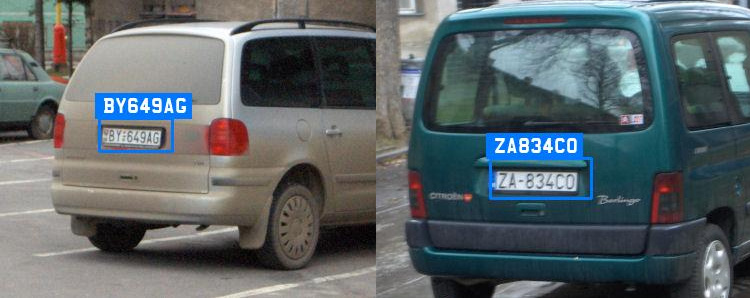

# Automatic License Plate Recognition API

Accurate, fast and easy to use API for license plate recognition. Trained on data from over 100 countries and regions around the world. The core of our license plate detection system is based on state of the art deep neural networks architectures.

Integrate with our ALPR API in a few lines of code. Get an easy to use JSON response with the number plate value of vehicles and the bounding boxes.

<p align="center">
  
</p>

  - [Reading License Plates from **Images**](#reading-license-plates-from-images)
    - [Process images from an FTP server](#process-images-from-an-ftp-server)
    - [Blurring License Plates and Redaction](#blurring-license-plates-and-redaction)
    - [Benchmark](benchmark.md)
  - [Number Plate Recognition on a **Video** or Camera Stream](https://platerecognizer.com/stream/?utm_source=github&utm_medium=website)
  - [Automatic Image Transfer](#automatic-image-transfer)
  - [**Code Samples**](#code-samples)


## Reading License Plates from Images

Get your API key from [Plate Recognizer](https://platerecognizer.com/?utm_source=github&utm_medium=website). Replace **MY_API_KEY** with your API key and run the command below.

```
# Getting started!
git clone https://github.com/marcbelmont/deep-license-plate-recognition.git
cd deep-license-plate-recognition
pip install requests pillow

python plate_recognition.py --api-key MY_API_KEY /path/to/vehicle.jpg
```

The **result** includes the bounding `box`es (rectangle around object) and the `plate` value for each plate. View the details of the results on our [documentation](http://docs.platerecognizer.com/#license-plate-recognition).

```javascript
[
  {
    "version": 1,
    "results": [
      {
        "box": {
          "xmin": 85,
          "ymin": 85,
          "ymax": 211,
          "xmax": 331
        },
        "plate": "ABC123",
        "score": 0.904,
        "dscore": 0.92
      }
    ],
    "filename": "car.jpg"
  }
]
```


#### Lookups For a Specific Region

You can match the license plate patterns of a specific region.

`python plate_recognition.py --api-key MY_API_KEY --regions fr --regions it /path/to/car.jpg`


#### Process Multiple Files (Batch Mode)

You can also run the license plate reader on many files at once. To run the script on all the images of a directory, use:

`python plate_recognition.py --api-key MY_API_KEY /path/to/car1.jpg /path/to/car2.jpg /path/to/trucks*.jpg`


#### Running the ALPR Locally (SDK)

To use a locally hosted sdk, pass the url to the docker container as follows:

`python plate_recognition.py  --sdk-url http://localhost:8080 /path/to/vehicle.jpg`

<br><br><br>

### Blurring License Plates and Redaction

The script `number_plate_redaction.py` differs from the default prediction script because it also detects plates that are **barely readable** and/or very small. It returns the bounding boxes of all the license plates. They can be used to blur or mask the license plates.

In addition, it can **split the image** in smaller images to better deal with high resolution images. This will use **3 lookups** instead of just 1. To use this options add `--split-image`.

The option `--save-blurred` lets you save blurred images. They are saved to a new file with `_blurred` suffix.

```
python number_plate_redaction.py --help
python number_plate_redaction.py --api-key API_KEY vehicels.jpg
python number_plate_redaction.py --sdk-url http://localhost:8080 --split-image vehicels.jpg
```

<br><br><br>

### Process images from an FTP server

To process images from the FTP server run `ftp_processor` script:

`python ftp_processor.py --api-key MY_API_KEY --ftp-host hostname --ftp-user user --ftp-password password --folder /path/to/server_folder`

To remove images from FTP server after processing, add the argument `--delete`.

<br><br><br>

## Automatic Image Transfer

Automatic Image Transfer is a command line tool that runs our [ALPR Engine](https://platerecognizer.com). It **monitors a folder** and automatically process images (Cloud or SDK) as they are added. Once processed, images are moved to an archive directory. It can also **forward the results** to our parking management service [Parkpow](https://parkpow.com/?utm_source=github&utm_medium=website).

To get started: `python transfer.py --help`

<br><br><br>

## Code Samples

See our sample projects to easily get started with the API.
- Example program in [C++](cpp/).
- Example program in [C#](csharp/).
- Example program in [Java](java/).
- [Android App](https://github.com/parkpow/alpr-anpr-android). It lets you take a picture and send it to our API.
- View how to integrate with other languages in our [documentation](http://docs.platerecognizer.com/#introduction).
- A Node-RED node for [license plate recognition](https://github.com/parkpow/node-red-contrib-plate-recognizer).

<br><br><br>

---
Have questions?  [Let us know](https://platerecognizer.com/contact?utm_source=github&utm_medium=website) how we can help.

Provided by Plate Recognizer, a subsidiary of [ParkPow](https://parkpow.com/?utm_source=github&utm_medium=website).
