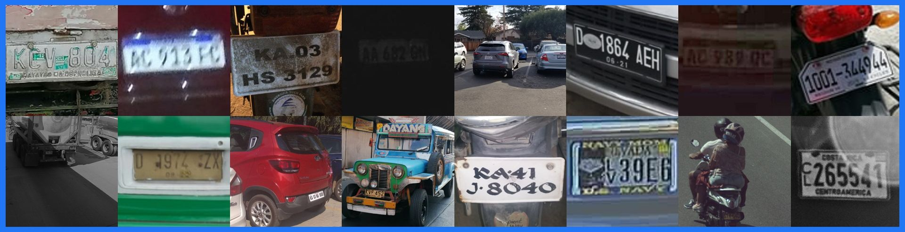

# Automatic License Plate Recognition Software (ALPR, ANPR)

Get high-accuracy, developer-friendly **automatic license plate recognition** ([ALPR](https://platerecognizer.com/?utm_source=github&amp;utm_medium=website)) or automatic number plate recognition ([ANPR](https://platerecognizer.com/?utm_source=github&amp;utm_medium=website)) software! The core of our ALPR, ANPR system is based on state of the art deep neural networks architectures.

- [Reading License Plates from **Images**](#reading-license-plates-from-images)
  - [Process images from an FTP or SFTP server](#process-images-from-an-ftp-or-sftp-server)
  - [Blurring License Plates and Redaction](#blurring-license-plates-and-redaction)
  - [Benchmark](benchmark/)
- [Number Plate Recognition on a **Video** or Camera Stream](https://platerecognizer.com/stream/?utm_source=github&utm_medium=website)
- [Automatic Image Transfer](#automatic-image-transfer)
- [**Code Samples**](#code-samples)

<p align="center">
  
</p>

Our machine-learning software:
  - Works on **dark, low-res, blurry images** and tough angles, all vehicle types, etc.  See our full [ALPR results](https://platerecognizer.com/alpr-results/?utm_source=github&amp;utm_medium=website).
  - Decodes **license plate** , vehicle type (e.g. SUV, van, pickup truck), [**vehicle make model**](https://platerecognizer.com/vehicle-make-model-recognition-with-color/?utm_source=github&amp;utm_medium=website) (e.g. Honda Accord), color, and orientation. Ignores bumper stickers, car signs, etc.
  - Is optimized for all [50 USA States](https://platerecognizer.com/alpr-for-usa/?utm_source=github&amp;utm_medium=website), [India](https://platerecognizer.com/anpr-for-india?utm_source=github&amp;utm_medium=website), [Brazil](https://platerecognizer.com/anpr-for-brazil/?utm_source=github&amp;utm_medium=website) and [**90+ countries worldwide**](https://platerecognizer.com/countries/?utm_source=github&amp;utm_medium=website).

**Snapshot** : Get license plate reader from images in under 60 minutes:
- Access a **simple REST API** for easy integration in [8 programming languages](http://docs.platerecognizer.com/?utm_source=github&amp;utm_medium=website).
- Returns results via **JSON Response** or Webhooks.
- Has [fast inference speed](https://platerecognizer.com/snapshot/#speeds) up to 21 ms.
- Runs on-premise on **Linux, Windows** , Mac, Jetson **,** [**Kubernetes**](https://platerecognizer.com/anpr-on-kubernetes/?utm_source=github&amp;utm_medium=website), [Raspberry Pi](https://platerecognizer.com/anpr-on-raspberry-pi/?utm_source=github&amp;utm_medium=website), [Zynq](https://platerecognizer.com/alpr-for-xilinx-zynq/?utm_source=github&amp;utm_medium=website), [96Boards](https://platerecognizer.com/alpr-for-96boards/?utm_source=github&amp;utm_medium=website), [LattePanda](https://platerecognizer.com/anpr-on-lattepanda/?utm_source=github&amp;utm_medium=website) and more.

**Stream** : Get number plate recognition from camera or video feed:
- Returns license plate results via **CSV file** or [**Webhooks**](https://platerecognizer.com/alpr-webhooks/?utm_source=github&amp;utm_medium=website).
- Handles 4 cameras simultaneously on mid-range PC.
- Runs on-premise on **Linux, Windows** , Mac and [**Jetson**](https://platerecognizer.com/alpr-on-nvidia-jetson-devices/?utm_source=github&amp;utm_medium=website).

ALPR, ANPR software is ideal for parking, highway monitoring, toll, police surveillance, community security, and other use cases. Our [license plate recognition (LPR)](https://platerecognizer.com/snapshot/?utm_source=github&amp;utm_medium=website) software can also forward results to our full **ALPR Dashboard** and [**Parking Management software**](https://parkpow.com/?utm_source=github&amp;utm_medium=website) solution, ParkPow. Sign up for a [**Free Trial**](https://app.platerecognizer.com/accounts/signup/?utm_source=github&amp;utm_medium=website) now (no credit card required) or **learn more** at [https://platerecognizer.com](https://platerecognizer.com/).

<br><br><br>

## Reading License Plates from Images

Get your API key from [Plate Recognizer](https://platerecognizer.com/?utm_source=github&utm_medium=website). Replace **MY_API_KEY** with your API key and run the command below.
> For setup instructions of the script, checkout our guides [here](https://guides.platerecognizer.com/docs/snapshot/bulk-processing#images-in-a-local-folder)
```
# Getting started!
git clone https://github.com/parkpow/deep-license-plate-recognition.git
cd deep-license-plate-recognition
pip install requests pillow

python plate_recognition.py --api-key MY_API_KEY /path/to/vehicle.jpg
```

The **result** includes the bounding `box`es (rectangle around object) and the `plate` value for each plate. View the details of the results on our [documentation](http://docs.platerecognizer.com/#license-plate-recognition).

```javascript
[
  {
    "version": 1,
    "results": [
      {
        "box": {
          "xmin": 85,
          "ymin": 85,
          "ymax": 211,
          "xmax": 331
        },
        "plate": "ABC123",
        "score": 0.904,
        "dscore": 0.92
      }
    ],
    "filename": "car.jpg"
  }
]
```


#### Lookups For a Specific Region

You can match the license plate patterns of a specific region.

`python plate_recognition.py --api-key MY_API_KEY --regions fr --regions it /path/to/car.jpg`


#### Process Multiple Files (Batch Mode)

You can also run the license plate reader on many files at once. To run the script on all the images of a directory, use:

`python plate_recognition.py --api-key MY_API_KEY /path/to/car1.jpg /path/to/car2.jpg /path/to/trucks*.jpg`


#### Running the ALPR Locally (SDK)

To use a locally hosted sdk, pass the url to the docker container as follows:

`python plate_recognition.py  --sdk-url http://localhost:8080 /path/to/vehicle.jpg`

<br><br><br>

### Blurring License Plates and Redaction

The script `number_plate_redaction.py` differs from the default prediction script because it also detects plates that are **barely readable** and/or very small. It returns the bounding boxes of all the license plates. They can be used to blur or mask the license plates.

In addition, it can **split the image** in smaller images to better deal with high resolution images. This will use **3 lookups** instead of just 1. To use this options add `--split-image`.

The option `--save-blurred` lets you save blurred images. They are saved to a new file with `_blurred` suffix.

The option `--ignore-regexp` lets you specify a regex of plates to ignore from blur. This option can be specified multiple times.

The option `--ignore-no-bb` lets you ignore recognitions without a vehicle bounding box from blur.

```
python number_plate_redaction.py --help
python number_plate_redaction.py --api-key API_KEY vehicels.jpg
python number_plate_redaction.py --sdk-url http://localhost:8080 --split-image vehicels.jpg

python number_plate_redaction.py --api-key 77c### 58C5A57_14965463.jpg --save-blurred --ignore-regexp ^58c5a57$ --ignore-regexp ^[0-9][0-9]c5a57$

```

<br><br><br>

### Process images from an FTP or SFTP server

You can send images directly to our FTP. See our [FTP integration](https://app.platerecognizer.com/start/camera-software) for details.

If you want to use your own FTP or SFTP server, another option is to process images with `ftp_and_sftp_processor.py`:
> For setup instructions of the script, checkout our guides [here](https://guides.platerecognizer.com/docs/snapshot/bulk-processing#images-are-on-an-ftp-or-sftp-server)

`python ftp_and_sftp_processor.py --api-key MY_API_KEY --hostname FTP_HOST_NAME --ftp-user FTP_USER --ftp-password FTP_USER_PASSWORD --folder /path/to/server_folder`

By default the script is prepared to process images in FTP servers, if you want to process images in an SFTP server, add the argument `--protocol sftp`.

To remove images from FTP or SFTP server after processing, add the argument `--delete`.

| Arguments              | Description                                                                                 |
|------------------------|---------------------------------------------------------------------------------------------|
| -h, --help             | Show help message                                                                           |
| -a, --api-key          | Your API key.                                                                               |
| -r, --regions          | Match the license plate pattern for a specific region.                                      |
| -s, --sdk-url          | URL to self-hosted SDK. For example, http://localhost:8080                                  |
| -c, --protocol         | Protocol to use, available choices 'ftp'(default) or 'sftp'                                          |
| -t, --timestamp        | Timestamp.                                                                                  |
| -H, --hostname         | Host.                                                                                       |
| -p, --port             | Port                                                                                        |
| -U, --ftp-user         | Transfer protocol server user                                                               |
| -P, --ftp-password     | Transfer protocol server user's password                                                    |
| -d, --delete           | Remove images from the FTP server after processing. Optionally specify a timeout in seconds.|
| -f, --folder           | Specify a folder with images on the FTP server.                                             |
| -o, --output-file      | Save the result to a file.                                                                  |
| -i, --interval         | Periodically fetch new images from the server every interval seconds.                       |
| --camera-id            | Name of the source camera.                                                                  |
| --cameras-root         | Root folder containing dynamic cameras.                                                     |
| --format               | Format of the result, available choices 'json'(default) or 'csv'                            |
| --mmc                  | Predict vehicle make and model (SDK only). It has to be enabled.                            |
| --pkey                 | SFTP Private Key Path.                                                                      |

<br><br><br>

## Automatic Image Transfer

Automatic Image Transfer is a command line tool that runs our [ALPR Engine](https://platerecognizer.com). It **monitors a folder** and automatically process images (Cloud or SDK) as they are added. Once processed, images are moved to an archive directory. It can also **forward the results** to our parking management service [Parkpow](https://parkpow.com/?utm_source=github&utm_medium=website).

To get started: `python transfer.py --help`

<br><br><br>

## Code Samples

See our sample projects to easily get started with the API.
- Example program in [C++](cpp/).
- Example program in [C#](csharp/).
- Example program in [Java](java/).
- [Android App](https://github.com/parkpow/alpr-anpr-android). It lets you take a picture and send it to our API.
- [Android App](https://github.com/kjbaker-uk/platerecognizer-android-example) in Kotlin.
- View how to integrate with other languages in our [documentation](http://docs.platerecognizer.com/#introduction).
- A Node-RED node for [license plate recognition](https://github.com/parkpow/node-red-contrib-plate-recognizer).
- Or [convert](https://curlconverter.com/) the curl examples to other languages.

<br><br><br>

---
Have questions?  [Let us know](https://platerecognizer.com/contact?utm_source=github&utm_medium=website) how we can help.

Provided by Plate Recognizer, a subsidiary of [ParkPow](https://parkpow.com/?utm_source=github&utm_medium=website).
