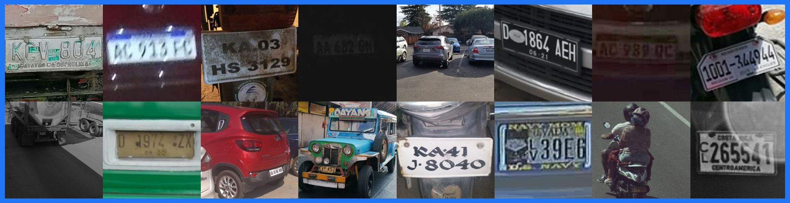

# Plate Recognizer examples and utilities

This repository contains example clients, integrations, and operational utilities
for [Plate Recognizer](https://platerecognizer.com/) Snapshot, Stream, Blur, and
ParkPow. It does not contain the recognition models themselves.

Use the quickstart below to recognize a plate in an image, or jump to the
[repository map](#repository-map) to find a tool for another workflow.



## Image recognition quickstart

### Prerequisites

- Python 3.8 or newer
- A [Plate Recognizer API token](https://app.platerecognizer.com/start/), or a
  running self-hosted Snapshot SDK

Clone the repository and install the two dependencies required by the image
client:

```bash
git clone https://github.com/parkpow/deep-license-plate-recognition.git
cd deep-license-plate-recognition
python -m venv .venv
source .venv/bin/activate  # On Windows: .venv\Scripts\activate
python -m pip install requests pillow
```

Run recognition against the cloud API:

```bash
python plate_recognition.py --api-key MY_API_KEY /path/to/vehicle.jpg
```

Replace `MY_API_KEY` locally and do not commit your token. To use a running
self-hosted Snapshot SDK instead:

```bash
python plate_recognition.py --sdk-url http://localhost:8080 /path/to/vehicle.jpg
```

The command returns JSON containing the recognized plate, confidence scores,
and bounding box. The complete response schema is in the
[Snapshot API reference](https://docs.platerecognizer.com/#license-plate-recognition).

```json
[
  {
    "version": 1,
    "results": [
      {
        "box": {"xmin": 85, "ymin": 85, "ymax": 211, "xmax": 331},
        "plate": "ABC123",
        "score": 0.904,
        "dscore": 0.92
      }
    ],
    "filename": "car.jpg"
  }
]
```

### Common image workflows

Limit recognition to one or more regions:

```bash
python plate_recognition.py --api-key MY_API_KEY --regions fr --regions it /path/to/car.jpg
```

Process several files or a shell glob:

```bash
python plate_recognition.py --api-key MY_API_KEY /path/to/car1.jpg /path/to/car2.jpg /path/to/trucks*.jpg
```

Run `python plate_recognition.py --help` for all available output, annotation,
cropping, and engine options. See the
[bulk-processing guide](https://guides.platerecognizer.com/docs/snapshot/bulk-processing#images-in-a-local-folder)
for a longer walkthrough.

## Repository map

| Goal | Tool or directory | Documentation |
| --- | --- | --- |
| Recognize plates in images | `plate_recognition.py` | [Quickstart](#image-recognition-quickstart) |
| Redact plates in images | `number_plate_redaction.py` | [Redaction](#plate-redaction) |
| Process an FTP or SFTP server | `ftp_and_sftp_processor.py` | [FTP and SFTP](#ftp-and-sftp-processing) |
| Monitor and transfer new images | `transfer.py` | [Automatic image transfer](#automatic-image-transfer) |
| Operate on Stream videos and images | [`stream/`](stream/) | [Stream utilities](stream/README.md) |
| Integrate webhook consumers | [`webhooks/`](webhooks/) | [Webhook integrations](webhooks/README.md) |
| Integrate ParkPow and camera systems | [`parkpow/`](parkpow/) | Per-integration READMEs |
| Run Blur or edit video | [`blur/`](blur/), [`video-editor/`](video-editor/) | [Blur](blur/README.md), [video editor](video-editor/README.md) |
| Install or manage an on-premise SDK | [`docker/`](docker/) | [On-premise tools](docker/README.md) |
| Run performance benchmarks | [`benchmark/`](benchmark/) | [Benchmarks](benchmark/README.md) |
| Use another language | [`cpp/`](cpp/), [`csharp/`](csharp/), [`java/`](java/) | [Language examples](#language-examples) |
| Control a gate relay | [`gate-controller/`](gate-controller/) | [GateController](gate-controller/README.md) |

Each subproject has its own dependencies. Follow its README or requirements
file instead of assuming the image-client installation covers the entire
repository. The root `pyproject.toml` contains the shared Python development
environment.

## Plate redaction

`number_plate_redaction.py` detects plates—including small or barely readable
ones—and can save a blurred copy of an image.

```bash
python number_plate_redaction.py --api-key MY_API_KEY vehicle.jpg --save-blurred
```

Useful options include:

- `--split-image` for high-resolution images; this uses three API lookups.
- `--ignore-regexp REGEX` to leave matching plates unblurred. Repeat the option
  to provide more than one expression.
- `--ignore-no-bb` to ignore results without a vehicle bounding box.

```bash
python number_plate_redaction.py \
  --sdk-url http://localhost:8080 \
  --split-image \
  --save-blurred \
  vehicle.jpg
```

Run `python number_plate_redaction.py --help` for the complete CLI reference.

## FTP and SFTP processing

Use `ftp_and_sftp_processor.py` to fetch images from your own FTP or SFTP
server and recognize them with the cloud API or a self-hosted SDK.

```bash
python -m pip install requests pillow paramiko
python ftp_and_sftp_processor.py \
  --api-key MY_API_KEY \
  --hostname FTP_HOST_NAME \
  --ftp-user FTP_USER \
  --ftp-password FTP_PASSWORD \
  --folder /path/to/server_folder
```

Add `--protocol sftp` for SFTP. Authentication can use `--ftp-password` or
`--pkey`. The `--delete` option removes processed remote files, so test without
it first. Run `python ftp_and_sftp_processor.py --help` for camera, polling,
output format, and SDK options.

See the [FTP/SFTP bulk-processing guide](https://guides.platerecognizer.com/docs/snapshot/bulk-processing#images-are-on-an-ftp-or-sftp-server)
for setup details. Plate Recognizer also provides a hosted
[FTP integration](https://app.platerecognizer.com/start/camera-software).

## Automatic image transfer

`transfer.py` watches a directory, recognizes new images, and moves processed
images into an archive. It can optionally forward results to
[ParkPow](https://parkpow.com/).

```bash
python -m pip install requests watchdog jsonlines
python transfer.py --help
```

The help output includes examples for the cloud API and a self-hosted SDK, as
well as the required source, archive, and camera-path options.

## Language examples

- [C++](cpp/)
- [C#](csharp/)
- [Java](java/)
- [Android example in Java](https://github.com/parkpow/alpr-anpr-android)
- [Android example in Kotlin](https://github.com/kjbaker-uk/platerecognizer-android-example)
- [Node-RED integration](https://github.com/parkpow/node-red-contrib-plate-recognizer)

For other languages, start with the
[API documentation](https://docs.platerecognizer.com/#introduction) or convert
the API's curl examples with [curlconverter](https://curlconverter.com/).

## Support and license

For product questions, [contact Plate Recognizer](https://platerecognizer.com/contact?utm_source=github&utm_medium=website).
This repository is provided under the terms in [LICENSE](LICENSE).

Plate Recognizer is a subsidiary of [ParkPow](https://parkpow.com/).
