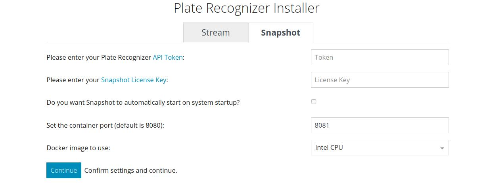

# Plate Recognizer Installer

  

This program helps you get started with Stream or SDK.
## Windows
1. **Download** the **[Windows Installer](https://app.platerecognizer.com/static/installer/PlateRecognizer-Installer.exe)**
2. **Open** the executable
3. Open **http://127.0.0.1:8050/** in your Browser and Follow the on-screen instructions.

---
## Linux
1. **Download** the **[Linux Installer](https://app.platerecognizer.com/static/installer/PlateRecognizer-Installer)**
2. **Open** a terminal
3. Switch to downloaded file location: `cd ~/Downloads`
4. Make the file executable: `chmod +x PlateRecognizer-Installer`
5. Run in the installer from the terminal `./PlateRecognizer-Installer`
6. Open **http://127.0.0.1:8050/** in your Browser and Follow the on-screen instructions.

*Note:*
The user running the installer needs to have docker permission. (belong to the `docker` group or run as root)

---
## MacOS
1. **Download** the **[MacOS Installer](https://app.platerecognizer.com/static/installer/PlateRecognizer-Installer-MacOS)**
2. **Open** a terminal
3. Switch to downloaded file location: `cd ~/Downloads`
4. Make the file executable: `chmod +x PlateRecognizer-Installer-MacOS`
5. Right click on the file from the finder - Open
6. Open **http://127.0.0.1:8050/** in your Browser and Follow the on-screen instructions.
---

*Note:*
When using a video file, it must be within the stream directory. In `config.ini`, the path has to be [relative](https://docs.google.com/document/d/1vLwyx4gQvv3gF_kQUvB5sLHoY0IlxV5b3gYUqR2wN1U/edit#heading=h.u40inl8klrvj) to the stream directory. 

