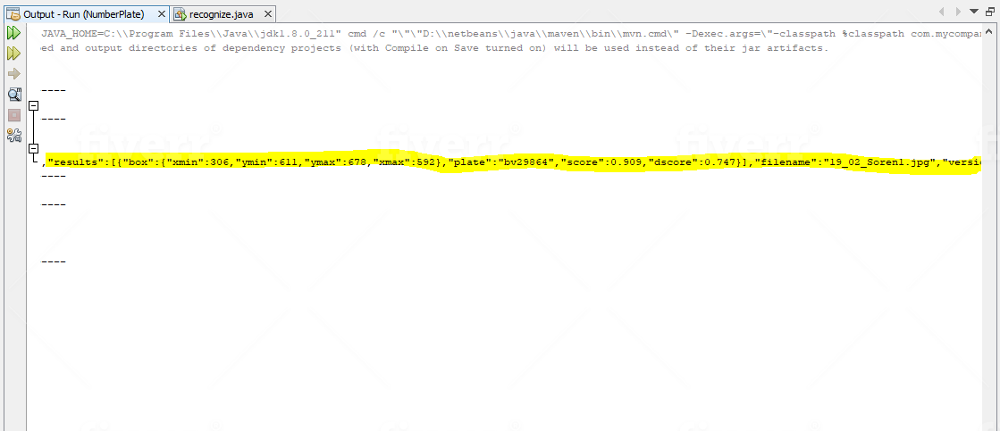

# Api Token
Get your API key from [Plate Recognizer](https://platerecognizer.com/). Replace **MY_API_KEY** with your API key in the file [recognize.java](PlateRecognizer/src/main/java/com/mycompany/numberplate/recognize.java)

# PlateRecognizer Java Client
This java client uses the [unirest](http://kong.github.io/unirest-java/) library.

If you are using maven, it is very easy to setup, Just add following line in your pom.xml

```
<dependency>
    <groupId>com.konghq</groupId>
    <artifactId>unirest-java</artifactId>
    <version>3.1.00</version>
    <classifier>standalone</classifier>
</dependency>

```

Update the `file` variable in [recognize.java](PlateRecognizer/src/main/java/com/mycompany/numberplate/recognize.java) and run your project, it will automatically download the library!


<p align="center">
  
</p>
