### Webhook via AWS Lambda example

This guide aims to provide you with a minimum sample to receive webhook data from Snapshot/Stream on your AWS Lambda
instance.

#### Create Lambda function

1. Open Lambda on your AWS dashboard.
2. Click "Create function".
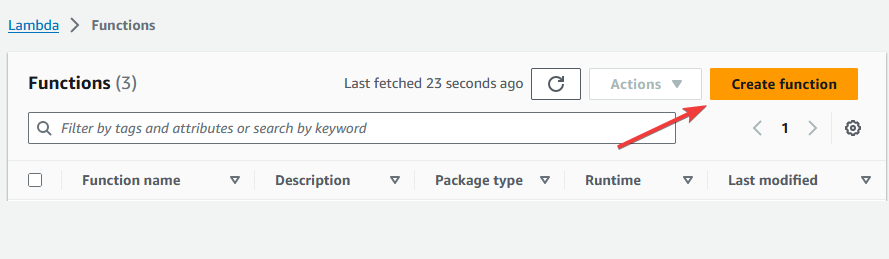
3. Fill the function name with "test_webhook". Select Python 3.10 for the Runtime, then click "Create function".
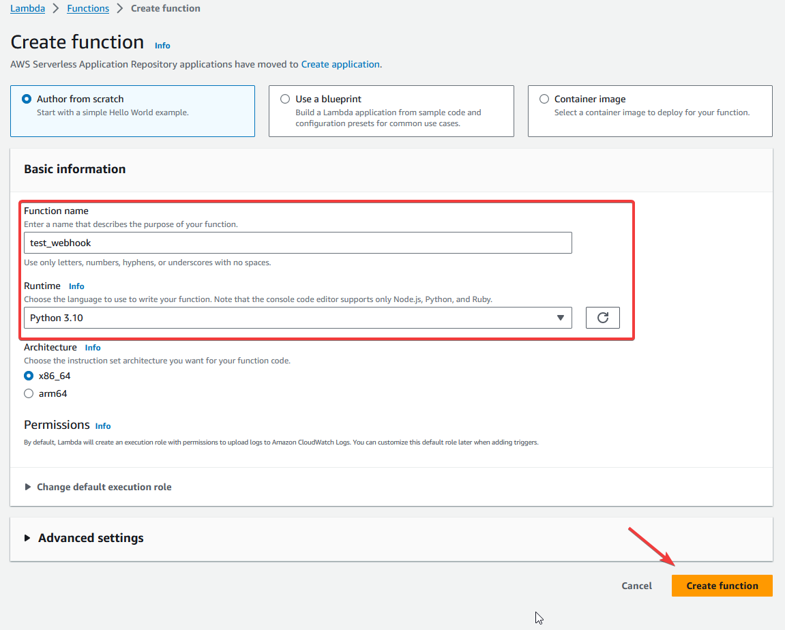
4. Inside the code editor, replace the content with the code from [lambda_function.py](./lambda_function.py). This code sample will receive
   webhook data and log them into CloudWatch.
5. Click Deploy
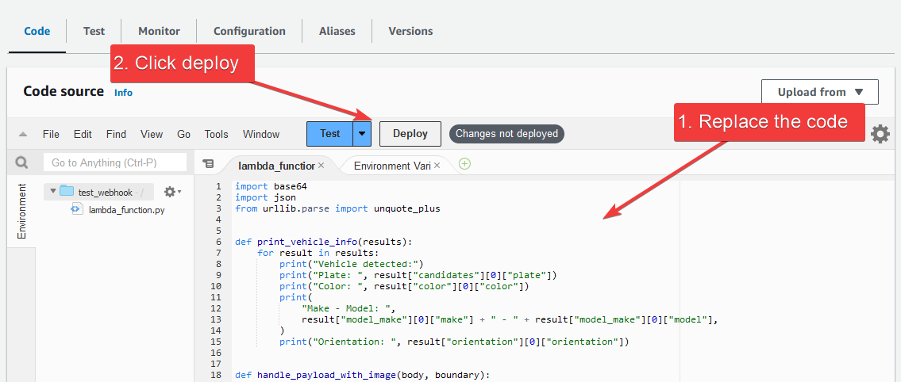

### Create API gateway

1. Open API Gateway dashboard in AWS.
2. Click "Create API"
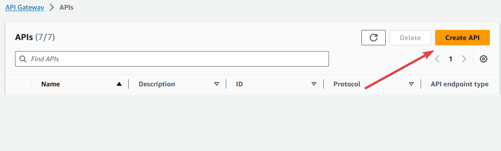
3. Click the "Build" button for HTTP API.
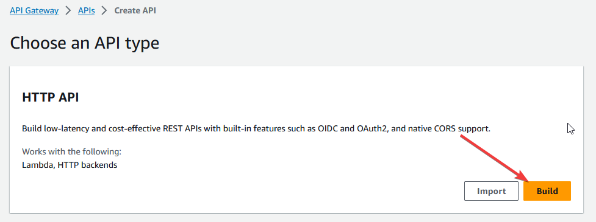
4. Click "Add integration", then select Lambda.
5. In the "Lambda function" text box, search for the function you created earlier.
6. Fill "API name" with "test_api". Then click the "Next" button.
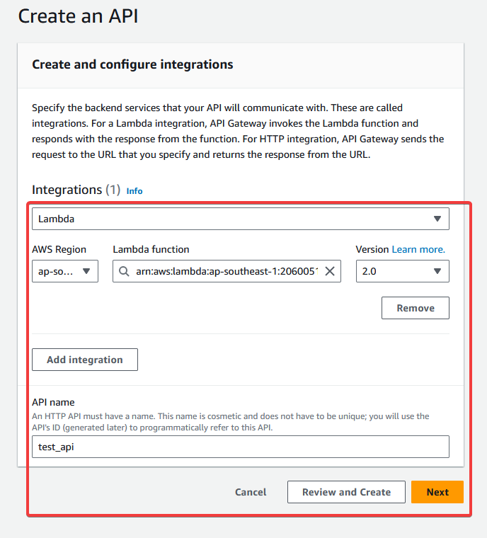
7. Select "POST" as the Method. Click "Next".
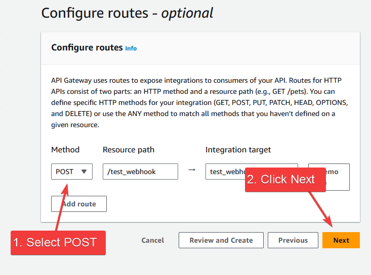
8. We are going to skip creating Stages, so click "Next" again and then click "Create".
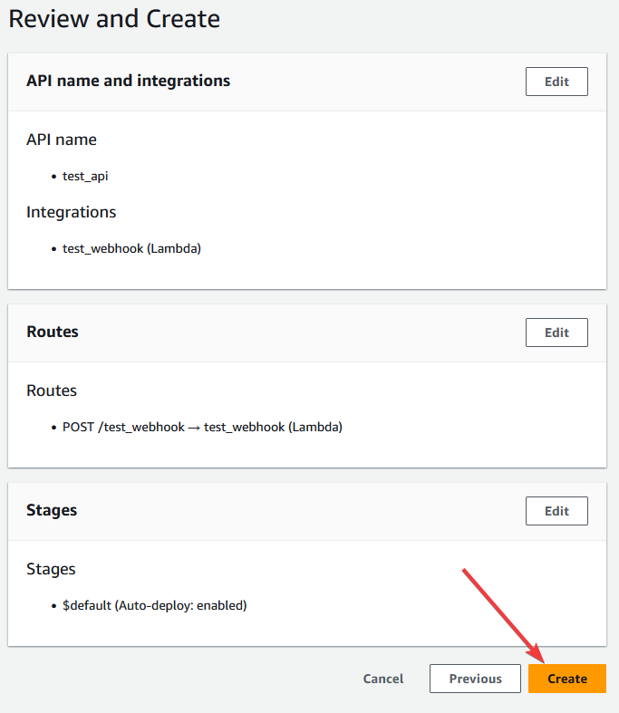
9. On the left side menu, click the link "API: test_api".
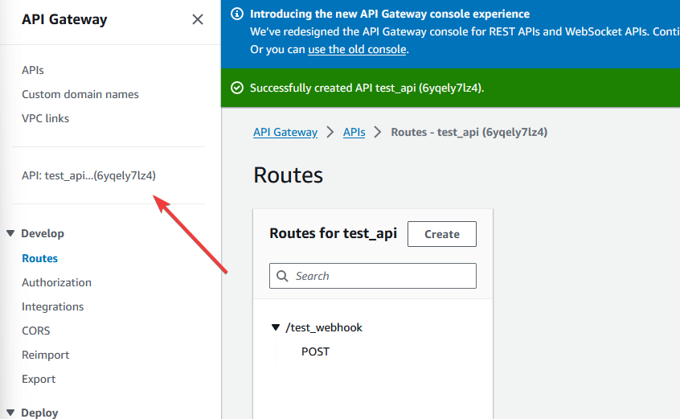
10. Copy the "Invoke URL". Put this url into your Snapshot/Stream webhook configuration and append it
    with `/test_webhook`.
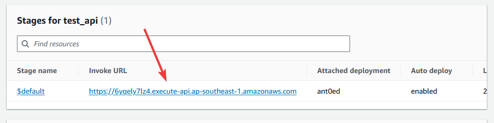

### CloudWatch logs
1. Open "CloudWatch" in AWS.
2. Open Logs > Log groups.
3. Click the log group for "test_webhook".
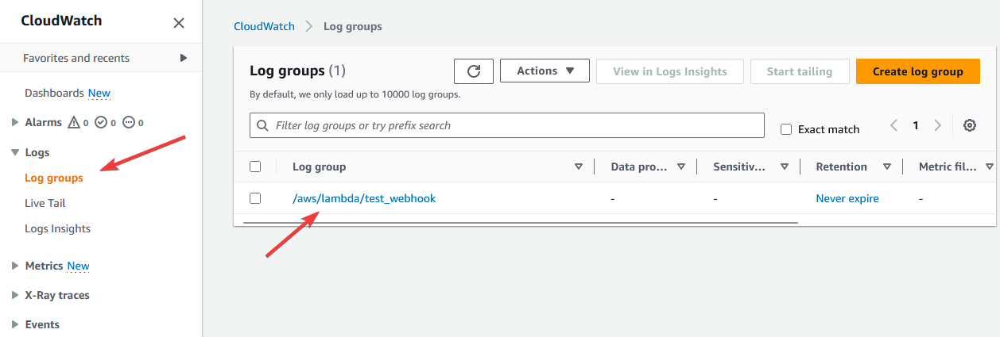
4. When your webhook receive new data, it will log the basic information about the vehicle here.